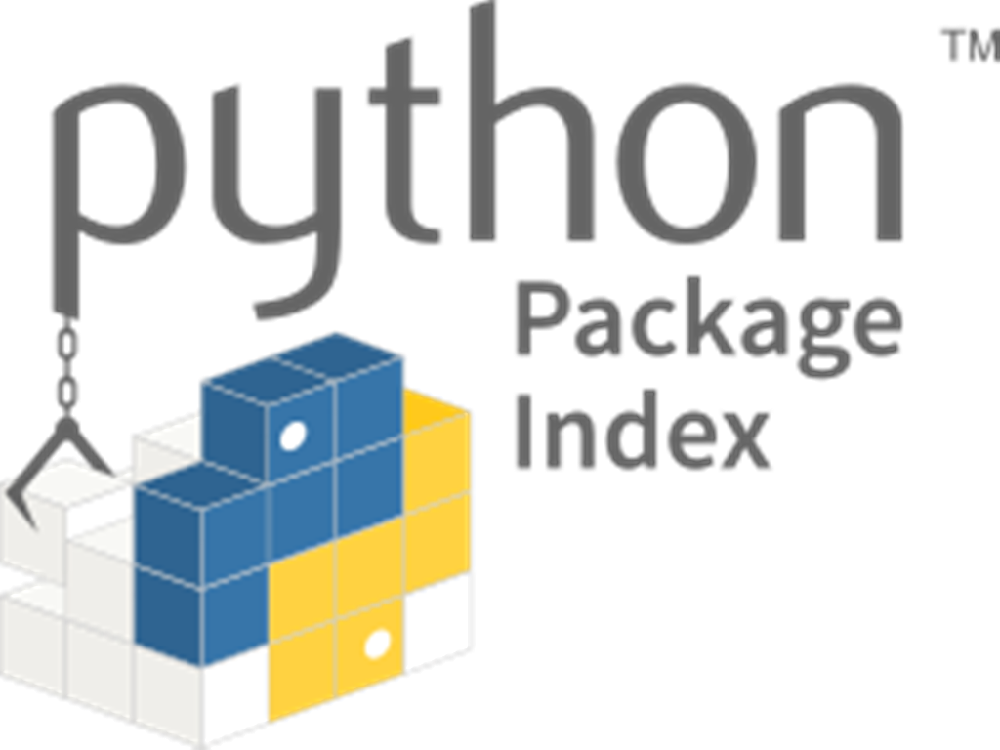

[Python Packaging Authority](https://www.pypa.io/en/latest/#python-packaging-authority)

The Python Packaging Authority (***PyPA***) is a working group that maintains a core set of software projects used in Python packaging.

---

The software developed through the ***PyPA*** is used to package, share, and install Python software and to interact with indexes of downloadable Python software such as [***PyPI***](https://pypi.org/), the Python Package Index. Click the logo below to download pip, the most prominent software used to interact with ***PyPI***.

---

The ***PyPA*** publishes the [Python Packaging User Guide](https://packaging.python.org/), which is **the authoritative resource on how to package, publish, and install Python projects using current tools**. The User Guide provides a user introduction to packaging, and explains how to use these tools. In case you need to package Python with other languages (for example, in a scientific Python package), the user guide also offers basic information about and links to available third-party packaging options (for example, [conda-forge](https://conda-forge.org/)).

---

For a listing of ***PyPA's*** important projects, see [the key projects list](https://packaging.python.org/key_projects/#pypa-projects "(in Python Packaging User Guide)"). The ***PyPA*** hosts projects on [GitHub](https://github.com/pypa) and [Bitbucket](https://bitbucket.org/pypa), and discusses issues in [the Packaging category on discuss.python.org](https://discuss.python.org/c/packaging) and on the [distutils-sig](http://mail.python.org/mailman/listinfo/distutils-sig) mailing list.

---

For a user introduction to packaging, see the [Python Packaging User Guide](https://packaging.python.org/)

-   [PyPA Goals](https://www.pypa.io/en/latest/future/)
-   [PyPA Specifications](https://www.pypa.io/en/latest/specifications/)
-   [PyPA Roadmap](https://www.pypa.io/en/latest/roadmap/)
-   [How to Help](https://www.pypa.io/en/latest/help/)
-   [Presentations & Articles](https://www.pypa.io/en/latest/presentations/)
-   [Packaging History](https://www.pypa.io/en/latest/history/)
-   [PyPA Members, And How To Join](https://www.pypa.io/en/latest/members/)
-   [Code of Conduct](https://www.pypa.io/en/latest/code-of-conduct/)

---
